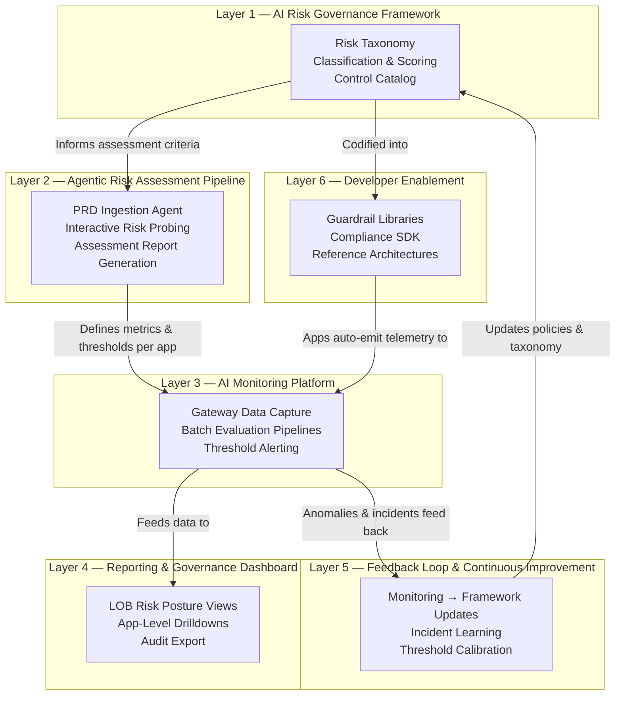
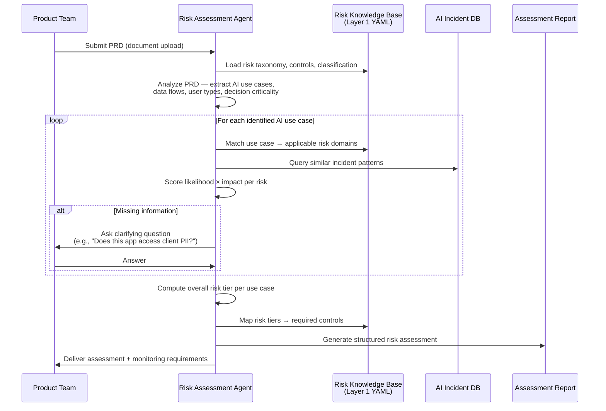
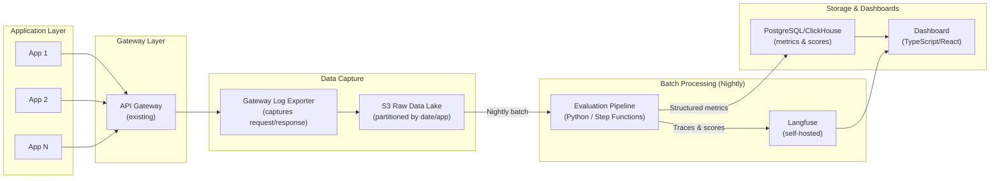
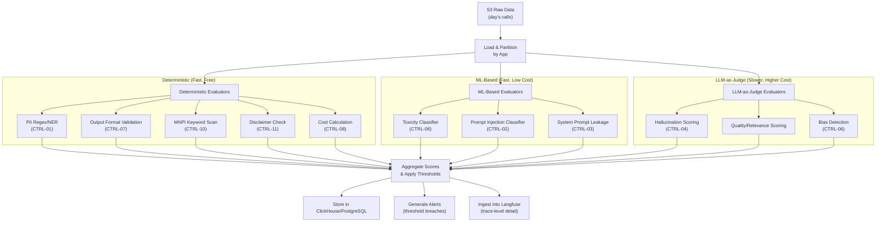
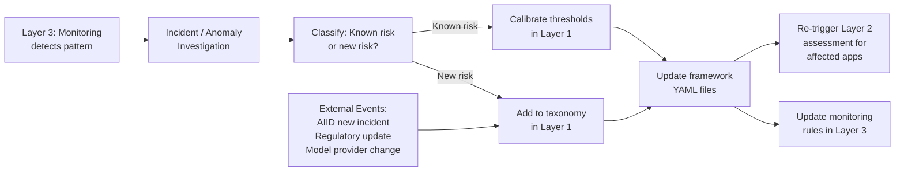

# AI Risk Governance Ecosystem — Investment Bank

## Vision

Build a comprehensive, end-to-end AI Risk Governance Ecosystem that enables the risk department to **define**, **assess**, **monitor**, **report**, and **continuously improve** the governance of all AI/LLM applications across the organization. This is not a single tool — it is an integrated platform spanning six layers, grounded in established international frameworks, and designed for a 2–4 person engineering team to deliver incrementally over 6 months (Phase 1) with ongoing evolution.

---

## Architecture Overview — The Six Layers



---

## Decisions Confirmed During Interview

| Decision | Choice |
|---|---|
| Inference provider | AWS Bedrock (Anthropic Claude), sole provider |
| Gateway architecture | Centralized API gateway, mandated via IAM, all apps routed through it |
| Brownfield strategy | Passive monitoring first — capture data via gateway, define thresholds later |
| Enforcement model | Monitor & Alert only — no inline blocking or redaction |
| Processing latency | Next business day (batch processing) |
| Quality evaluation | App teams define "correct" via golden test cases, rubrics, and expected output formats during governance onboarding |
| Governance model | Platform-as-a-service — risk dept provides platform; app teams define their own thresholds through governance process |
| Data sensitivity | Partial — some apps handle PII/sensitive data, design for worst case |
| Data retention | 1 year hot storage |
| Team size | 2–4 engineers, alongside other responsibilities |
| Tech stack | Python (backend/pipelines) + TypeScript (dashboard/UI) |
| Build vs. buy | Self-hosted open-source tools within VPC |
| Timeline | 6 months to first usable version |
| Reporting audience | Line-of-business heads (business unit risk posture) |
| Developer enablement | Guardrail libraries + compliance SDK + reference architectures |

---

# LAYER 1 — AI Risk Governance Framework

> [!IMPORTANT]
> This is the **foundation** of the entire ecosystem. Every downstream artifact — assessment questionnaires, monitoring rules, dashboards, escalation procedures — maps back to this framework. **Nothing ships without this being defined first.**

## 1.1 Grounding in Established Frameworks

The risk framework is not invented from scratch. It is a **synthesis** of nine established international frameworks, each contributing a specific dimension:

| Framework | What It Contributes to Our Framework | Role |
|---|---|---|
| **NIST AI RMF (AI 100-1 / AI 600-1)** | Structural backbone — the **Govern → Map → Measure → Manage** lifecycle + 12 GenAI-specific risk profiles | **Primary operational structure** |
| **MIT AI Risk Repository** | Comprehensive risk catalog — 777+ risks across 7 domains, 24 subdomains, with causal taxonomy | **Primary risk taxonomy source** |
| **SR 11-7 (Fed Model Risk Management)** | Mandatory banking model risk requirements — independent validation, three lines of defense, model inventory | **Regulatory compliance anchor** |
| **MITRE ATLAS** | Adversarial threat modeling — 14 tactical stages, LLM-specific attack techniques (prompt injection, RAG poisoning) | **Security & adversarial risk layer** |
| **EU AI Act** | Risk tiering (Unacceptable/High/Limited/Minimal), conformity assessment, Article 50 transparency obligations | **International regulatory readiness** |
| **ISO/IEC 42001** | Certifiable management system — 38 controls across 9 objectives, lifecycle gates, third-party supplier controls | **Enterprise governance controls** |
| **OECD AI Principles** | Ethical principles — fairness, transparency, explainability, accountability | **Ethical north star** |
| **MAS FEAT (Singapore)** | Financial-sector-specific fairness/ethics/accountability/transparency + Veritas quantitative testing toolkit | **Financial services fairness testing** |
| **AI Incident Database (AIID)** | 3,000+ real-world AI failure cases — Knight Capital, Apple Card, Air Canada chatbot liability | **Threat scenarios & lessons learned** |

## 1.2 Risk Taxonomy

The taxonomy is organized into **7 risk domains** (adapted from MIT AI Risk Repository), each with sub-categories refined for investment banking LLM use cases. Every risk has a unique identifier (e.g., `RC-01`) for traceability across assessment and monitoring.

### Domain 1: Regulatory & Compliance Risk

| ID | Risk | Description | Banking Context |
|---|---|---|---|
| RC-01 | Unauthorized investment advice | AI outputs that constitute regulated financial advice without proper licensing or disclaimers | Equity research summaries, client-facing chatbots |
| RC-02 | MNPI disclosure | Material non-public information leaked through prompts, responses, or training data | M&A deal analysis, earnings preview tools |
| RC-03 | Market manipulation | AI-generated content that could influence market prices or constitute market abuse | Trading desk assistants, sentiment analysis |
| RC-04 | Regulatory reporting errors | AI producing incorrect data used in regulatory filings | Capital calculations, stress test inputs |
| RC-05 | Cross-border data violations | Prompts or responses moving regulated data across jurisdictions | Global operations, GDPR/MAS compliance |

### Domain 2: Data Leakage & Privacy Risk

| ID | Risk | Description | Banking Context |
|---|---|---|---|
| DL-01 | PII in prompts | Users sending client personal data (names, SSN, account numbers) into LLM prompts | KYC tools, client onboarding assistants |
| DL-02 | PII in responses | Model generating outputs containing personal data from training or context | RAG over client databases |
| DL-03 | Proprietary strategy exposure | Internal trading strategies, algorithms, or deal terms exposed via prompts | Quant research tools, deal structuring |
| DL-04 | Client confidentiality breach | Information about one client leaking into responses for another | Multi-tenant applications |

### Domain 3: Output Quality & Accuracy Risk

| ID | Risk | Description | Banking Context |
|---|---|---|---|
| OQ-01 | Hallucination / Confabulation | AI generating fictitious financial figures, non-existent regulations, or fabricated sources | Research reports, compliance Q&A |
| OQ-02 | Factual inaccuracy | Outputs containing incorrect but plausible financial data | Valuation models, earnings summaries |
| OQ-03 | Incomplete analysis | AI omitting critical risk factors or relevant information | Credit assessments, due diligence |
| OQ-04 | Format/structure violation | Output not conforming to required format (e.g., JSON schema, report template) | Automated report generation |
| OQ-05 | Logical inconsistency | Self-contradictory statements within the same response | Multi-step analysis, reasoning chains |

### Domain 4: Bias & Fairness Risk

| ID | Risk | Description | Banking Context |
|---|---|---|---|
| BF-01 | Protected class discrimination | Outputs that disadvantage individuals based on race, gender, age, religion | Credit decisions, HR screening |
| BF-02 | Proxy discrimination | Latent demographic proxies (zip codes, alma mater) influencing outputs | Lending models, client segmentation |
| BF-03 | Geographic/cultural bias | Systematically different quality of service across regions or cultures | Global client-facing tools |
| BF-04 | Socioeconomic bias | Outputs favoring certain wealth brackets or company sizes | Advisory tools, wealth management |

### Domain 5: Adversarial & Misuse Risk

| ID | Risk | Description | Banking Context |
|---|---|---|---|
| AM-01 | Direct prompt injection | User crafting prompts to override system instructions or guardrails | Any user-facing LLM application |
| AM-02 | Indirect prompt injection | Malicious content in external documents hijacking LLM behavior when ingested via RAG | Document analysis, SEC filing parsing |
| AM-03 | System prompt extraction | Users manipulating the model to reveal proprietary system prompts | Any application with system prompts |
| AM-04 | Data exfiltration via prompts | Users strategically querying to reconstruct sensitive training data or knowledge base content | RAG applications over confidential data |
| AM-05 | Social engineering via AI | Using AI tools to craft more convincing phishing or fraud attempts | Internal communication tools |

### Domain 6: Reputational Risk

| ID | Risk | Description | Banking Context |
|---|---|---|---|
| RR-01 | Offensive or inappropriate content | Toxic, hateful, or sexually explicit outputs | Any client-facing or employee-facing tool |
| RR-02 | Brand misrepresentation | AI speaking with unwarranted authority or making commitments on behalf of the firm | Client chatbots, advisory tools |
| RR-03 | Confidentiality perception | Client perception that their data is being used by AI, even if technically compliant | All client-facing applications |

### Domain 7: Model Drift & Operational Risk

| ID | Risk | Description | Banking Context |
|---|---|---|---|
| MD-01 | Upstream model change | Provider (Anthropic) updates model weights, changing behavior without notice | All applications using Bedrock |
| MD-02 | Quality degradation over time | Gradual performance decline as data distributions shift | Long-running production applications |
| MD-03 | Context window exhaustion | Applications silently truncating context, losing critical information | Complex multi-document analysis |
| MD-04 | Cost escalation | Unexpected increase in token consumption due to prompt drift or user behavior changes | All applications |
| MD-05 | Availability & latency degradation | SLA violations impacting time-sensitive business processes | Trading support, real-time client tools |

## 1.3 Risk Classification Scheme

Every identified risk is scored along two dimensions to produce a **risk tier**:

### Severity Matrix

| | **Likelihood: Rare** | **Likelihood: Unlikely** | **Likelihood: Possible** | **Likelihood: Likely** | **Likelihood: Almost Certain** |
|---|---|---|---|---|---|
| **Impact: Catastrophic** | High | High | Critical | Critical | Critical |
| **Impact: Major** | Medium | High | High | Critical | Critical |
| **Impact: Moderate** | Low | Medium | Medium | High | High |
| **Impact: Minor** | Low | Low | Medium | Medium | High |
| **Impact: Insignificant** | Low | Low | Low | Medium | Medium |

### Impact Definitions (Investment Banking Context)

| Level | Financial | Regulatory | Reputational | Operational |
|---|---|---|---|---|
| **Catastrophic** | >\$50M loss | Regulatory sanctions, license threat | Front-page news, client exodus | Complete system failure, trading halt |
| **Major** | \$10M–\$50M | Formal investigation, MRA | Industry press coverage | Major service degradation, multiple apps affected |
| **Moderate** | \$1M–\$10M | Audit findings, informal supervisory comments | Social media attention | Single app outage, workaround available |
| **Minor** | \$100K–\$1M | Internal audit issues | Limited internal awareness | Degraded performance, no data loss |
| **Insignificant** | <\$100K | None | None | Cosmetic issues |

### Risk Tier → Required Controls Mapping

| Risk Tier | Required Controls | Monitoring Frequency | Governance Requirement |
|---|---|---|---|
| **Critical** | Full guardrail suite, human-in-the-loop mandatory, dual-model verification, quarterly red-team | Daily batch monitoring, immediate escalation on threshold breach | Senior management sign-off, quarterly review by risk committee |
| **High** | Input/output validation, PII detection, prompt injection detection, golden test suite ≥100 cases | Daily batch monitoring | Risk dept sign-off, semi-annual review |
| **Medium** | Output format validation, basic content filtering, golden test suite ≥25 cases | Weekly batch monitoring | App team self-assessment, annual review |
| **Low** | Usage analytics and cost tracking only | Monthly batch monitoring | App team self-service |

## 1.4 Control Catalog

Each control is a specific, implementable safeguard mapped to one or more risk IDs:

| Control ID | Control Name | Description | Applicable Risk IDs | Implementation Type |
|---|---|---|---|---|
| CTRL-01 | PII Detection & Flagging | Regex + NER-based scanning of prompts and responses for personal data patterns | DL-01, DL-02, RC-05 | Automated (batch evaluation) |
| CTRL-02 | Prompt Injection Detection | Classifier-based detection of injection attempts in user inputs | AM-01, AM-02 | Automated (batch evaluation) |
| CTRL-03 | System Prompt Leakage Detection | Scanning responses for fragments matching known system prompts | AM-03 | Automated (batch evaluation) |
| CTRL-04 | Hallucination Scoring | LLM-as-judge or RAG groundedness check against source documents | OQ-01, OQ-02 | Automated (LLM eval, batch) |
| CTRL-05 | Golden Test Suite Regression | Periodic re-execution of app-defined golden test cases to detect drift | MD-01, MD-02, OQ-01 | Automated (scheduled batch) |
| CTRL-06 | Content Safety Scoring | Toxicity, bias, and offensive content detection in outputs | RR-01, BF-01, BF-02 | Automated (classifier, batch) |
| CTRL-07 | Output Format Validation | Schema validation for structured outputs (JSON, CSV, specific templates) | OQ-04 | Automated (deterministic) |
| CTRL-08 | Cost & Token Tracking | Per-app, per-team token consumption and cost calculation | MD-04 | Automated (aggregation) |
| CTRL-09 | Human Review Sampling | Random sampling of production calls for manual expert review | All Critical tier risks | Manual (human process) |
| CTRL-10 | MNPI Keyword Detection | Domain-specific keyword/pattern scanning for material non-public information | RC-02, DL-03 | Automated (regex + NER) |
| CTRL-11 | Regulatory Disclaimer Verification | Checking that required disclaimers are present in applicable outputs | RC-01, RR-02 | Automated (deterministic) |
| CTRL-12 | Red Team Exercise | Structured adversarial testing against MITRE ATLAS techniques | AM-01 through AM-05 | Manual (quarterly) |

## 1.5 Framework as a Structured Knowledge Base

> [!TIP]
> The risk taxonomy, classification scheme, and control catalog should be stored as **structured data** (YAML/JSON), not just documents. This enables the agentic assessment pipeline (Layer 2) to programmatically query and reason over the framework.

```
governance-framework/
├── taxonomy/
│   ├── domains.yaml              # 7 risk domains
│   ├── risks.yaml                # All risk IDs with descriptions, examples
│   └── banking_context.yaml      # Investment-banking-specific elaborations
├── classification/
│   ├── severity_matrix.yaml      # Likelihood × Impact → Tier
│   ├── impact_definitions.yaml   # Financial/regulatory/reputational thresholds
│   └── tier_controls.yaml        # Required controls per risk tier
├── controls/
│   ├── control_catalog.yaml      # All controls with IDs, descriptions, types
│   └── control_risk_mapping.yaml # Which controls mitigate which risks
├── frameworks/
│   ├── nist_ai_rmf_mapping.yaml  # How our taxonomy maps to NIST AI 600-1
│   ├── sr11_7_mapping.yaml       # How our taxonomy maps to SR 11-7 requirements
│   ├── mitre_atlas_mapping.yaml  # How our adversarial risks map to ATLAS techniques
│   ├── eu_ai_act_mapping.yaml    # Risk tier → EU AI Act classification
│   └── mas_feat_mapping.yaml     # Fairness controls → MAS FEAT principles
├── incidents/
│   └── aiid_lessons.yaml         # Relevant AIID incidents mapped to our risk IDs
└── README.md                     # Framework overview and usage guide
```

---

# LAYER 2 — Agentic Risk Assessment Pipeline

> [!IMPORTANT]
> This agent is the **bridge between the governance framework and operational reality**. It takes a product requirement document and produces a structured risk assessment grounded in Layer 1.

## 2.1 Assessment Pipeline Architecture



## 2.2 What the Agent Does — Step by Step

### Step 1: PRD Ingestion & AI Use Case Extraction
The agent reads the PRD and extracts:
- **What AI does**: Summarization? Generation? Classification? Decision support? Autonomous action?
- **Data inputs**: What data enters the prompt? Client data? Market data? Internal documents?
- **Data outputs**: What does the response contain? Advice? Numbers? Documents?
- **User population**: Internal employees? Clients? Regulators? Public?
- **Decision criticality**: Informational only? Influences human decision? Autonomous execution?
- **Volume**: Expected calls/day? Users/day?

### Step 2: Risk Domain Mapping
Using the Layer 1 taxonomy, the agent maps each extracted use case to applicable risk domains:

Example for a "Client Portfolio Summary Generator":
```yaml
use_case: "Client Portfolio Summary Generator"
applicable_risks:
  - RC-01:  # Unauthorized investment advice
      rationale: "Summaries could be interpreted as investment recommendations"
      likelihood: Possible
      impact: Major
  - DL-01:  # PII in prompts
      rationale: "Client names and account details will be in prompts"
      likelihood: Almost Certain
      impact: Moderate
  - OQ-01:  # Hallucination
      rationale: "Could fabricate portfolio performance numbers"
      likelihood: Likely
      impact: Major
  - BF-01:  # Protected class discrimination
      rationale: "Unlikely — portfolio summaries are data-driven"
      likelihood: Rare
      impact: Minor
```

### Step 3: Interactive Probing
When the PRD is ambiguous or missing risk-relevant information, the agent asks targeted questions. These are **derived from the framework**, not ad-hoc:

| Missing Info | Agent Question | Why It Matters |
|---|---|---|
| Data sensitivity unclear | "Will any prompts contain client names, account numbers, or other PII? If yes, in what format and frequency?" | Determines DL-01/DL-02 scoring |
| User population unclear | "Who will use this tool — internal employees only, or external clients as well?" | External users trigger RC-01, RR-02 |
| Decision autonomy unclear | "Will users act directly on AI outputs, or is there a mandatory human review step before any business action?" | Autonomous action → higher impact scores |
| Data source unclear | "What documents or databases does the RAG pipeline query? Do they contain MNPI or restricted data?" | Determines RC-02, AM-02 exposure |
| Existing controls unclear | "Are there any existing guardrails, output validators, or content filters already in place?" | Avoids duplicate control recommendations |

### Step 4: Risk Scoring & Tier Assignment
For each identified risk, the agent scores likelihood × impact using the Layer 1 severity matrix, then assigns an overall risk tier to the application.

### Step 5: Assessment Report Generation
The agent produces a structured output:

```yaml
assessment:
  application_name: "Client Portfolio Summary Generator"
  assessment_date: "2026-09-07"
  assessor: "AI Risk Assessment Agent v1.0"
  overall_risk_tier: "High"
  
  identified_risks:
    - risk_id: RC-01
      risk_name: "Unauthorized investment advice"
      likelihood: Possible
      impact: Major
      tier: High
      recommended_controls: [CTRL-11, CTRL-09]
      monitoring_metrics:
        - metric: "Percentage of responses containing recommendation language"
          threshold: "< 2%"
          frequency: "Daily"
    
    - risk_id: DL-01
      risk_name: "PII in prompts"
      likelihood: Almost Certain
      impact: Moderate
      tier: High
      recommended_controls: [CTRL-01]
      monitoring_metrics:
        - metric: "Percentage of prompts containing detected PII"
          threshold: "< 0.5% (after input sanitization)"
          frequency: "Daily"
    
    # ... additional risks ...

  required_actions:
    before_deployment:
      - "Implement PII detection on all prompts (CTRL-01)"
      - "Add regulatory disclaimer to all outputs (CTRL-11)"
      - "Create golden test suite with ≥100 test cases (CTRL-05)"
    ongoing:
      - "Daily batch monitoring of all specified metrics"
      - "Quarterly human review sampling of 100 random calls (CTRL-09)"
      - "Semi-annual risk reassessment"
  
  governance_review:
    required_sign_off: "Risk department"
    review_frequency: "Semi-annual"
```

## 2.3 Brownfield Assessment Mode

For existing applications without PRDs:

1. **Gateway Data Analysis**: The agent analyzes a sample of actual prompt/response pairs captured from the gateway (e.g., 1,000 recent calls)
2. **Behavioral Risk Profiling**: Using the sampled data, the agent identifies which risk domains are empirically active (e.g., "15% of prompts contain patterns matching PII")
3. **Retrospective Assessment Report**: Same structured output as greenfield, but grounded in observed behavior rather than a PRD
4. **Gap Analysis**: Highlights what controls are missing compared to what the risk tier requires

## 2.4 Agent Technical Implementation

| Component | Technology | Rationale |
|---|---|---|
| Agent orchestration | Python + LangGraph or custom agent loop | Structured multi-step reasoning with state management |
| LLM backbone | Claude (via Bedrock) | Same provider as monitored apps, already approved |
| Knowledge base | Layer 1 YAML files loaded as structured context | Deterministic, version-controlled, auditable |
| AIID querying | Pre-indexed incident database (SQLite or embedded search) | Fast similarity matching for precedent incidents |
| Interactive UI | TypeScript/React web form | Product teams submit PRDs and answer follow-up questions |
| Output format | YAML + rendered PDF report | Machine-readable for Layer 3 ingestion + human-readable for governance board |

---

# LAYER 3 — AI Monitoring Platform

## 3.1 Data Capture Architecture

Since all Bedrock calls are mandated through the centralized API gateway and we need **batch (next-business-day) processing only**, the architecture is straightforward:



### Data Captured Per AI Call

| Field | Source | Purpose |
|---|---|---|
| `call_id` | Gateway | Unique identifier for traceability |
| `app_id` | Gateway | Application identifier for multi-tenant filtering |
| `user_id` (hashed) | Gateway | User behavior analysis (pseudonymized) |
| `timestamp` | Gateway | Time-series analysis |
| `model_id` | Gateway | Model version tracking for drift detection |
| `prompt_text` | Gateway | Input analysis, PII detection, prompt injection detection |
| `response_text` | Gateway | Output quality evaluation, safety checks |
| `input_tokens` | Bedrock response | Cost calculation, usage analytics |
| `output_tokens` | Bedrock response | Cost calculation, usage analytics |
| `latency_ms` | Gateway | Performance monitoring |
| `status_code` | Gateway | Error rate tracking |
| `system_prompt_hash` | Gateway / app metadata | Detect unauthorized system prompt changes |

## 3.2 Batch Evaluation Pipeline

The nightly batch pipeline applies the controls defined in Layer 1 against all captured calls:



### Evaluator Details

| Evaluator | Type | Cost | Controls | Implementation |
|---|---|---|---|---|
| PII Detection | Deterministic + NER | ~Free | CTRL-01 | Python regex + spaCy NER or AWS Comprehend |
| Output Format Validation | Deterministic | Free | CTRL-07 | JSON Schema validation, template matching |
| MNPI Keyword Scan | Deterministic | Free | CTRL-10 | Custom regex patterns (deal names, ticker-specific terms) |
| Disclaimer Verification | Deterministic | Free | CTRL-11 | String matching for required disclaimer text |
| Cost Calculation | Deterministic | Free | CTRL-08 | Token count × model pricing |
| Toxicity/Safety | ML Classifier | Low | CTRL-06 | AWS Comprehend toxicity or open-source classifier |
| Prompt Injection Detection | ML Classifier | Low | CTRL-02 | Fine-tuned classifier (e.g., rebuff, protectai) or Bedrock Guardrails |
| System Prompt Leakage | ML / Fuzzy Match | Low | CTRL-03 | Similarity scoring against known system prompts |
| Hallucination Scoring | LLM-as-Judge | Medium | CTRL-04 | Claude (via Bedrock) evaluating groundedness — **use only for Critical/High tier apps** |
| Quality/Relevance | LLM-as-Judge | Medium | — | Claude evaluating against app-specific rubrics — **sampled, not every call** |
| Bias Detection | LLM-as-Judge | Medium | CTRL-06 | Claude evaluating for demographic bias — **sampled** |

> [!TIP]
> **Cost optimization for LLM-as-Judge evaluators**: Run deterministic and ML evaluators on 100% of calls. Run LLM-as-Judge on a **sample** (e.g., 5–10% of daily calls for High-tier apps, 1% for Medium-tier). Only evaluate 100% when a threshold breach triggers deeper investigation.

## 3.3 Drift Detection

Drift is detected by comparing evaluation metrics over time windows:

| Drift Type | Detection Method | Alert Condition |
|---|---|---|
| Quality drift | Compare weekly average quality scores vs. 30-day rolling baseline | >10% decline in quality score |
| Cost drift | Compare weekly token consumption vs. 30-day rolling baseline | >25% increase in cost |
| Distribution drift | Compare embedding clusters of prompts week-over-week | New cluster >5% of traffic not seen in baseline |
| Error rate drift | Compare daily error rate vs. 30-day baseline | >2x baseline error rate |
| Guardrail activation drift | Compare daily CTRL violation rates vs. baseline | >50% increase in any CTRL violation rate |

## 3.4 Open-Source Tool Stack

| Component | Tool | Role | Deployment |
|---|---|---|---|
| Trace storage & exploration | **Langfuse** (self-hosted) | Store individual traces, explore prompt/response pairs, manage evaluations, prompt versioning | Docker on EKS, backed by ClickHouse + PostgreSQL + S3 |
| Telemetry standard | **OpenTelemetry + OpenLLMetry** | Standardized `gen_ai.*` span attributes, vendor-neutral instrumentation | OTel Collector on EKS |
| Advanced evaluation & embedding analysis | **Arize Phoenix** (optional, Phase 2) | RAG triad evaluation, embedding space visualization, UMAP clustering for drift | Docker on EKS |
| Batch pipeline orchestration | **AWS Step Functions** or **Airflow** | Nightly batch job scheduling and orchestration | Managed AWS service |
| Raw data storage | **S3** | Immutable log storage with 1-year retention | Managed AWS service |
| Metrics database | **ClickHouse** (via Langfuse) or **PostgreSQL (RDS)** | Aggregated metrics, scores, and alert state | Managed AWS service |

---

# LAYER 4 — Reporting & Governance Dashboard

## 4.1 Dashboard Architecture

The dashboard is a TypeScript/React web application serving line-of-business heads with risk posture views.

### View Hierarchy

```
Organization Overview (all LOBs)
  └── LOB View (e.g., "Equities Technology")
       └── Application View (e.g., "Equity Research Summarizer")
            └── Risk Domain Drilldown (e.g., "Output Quality")
                 └── Individual Flagged Call (prompt + response + scores)
```

### Key Dashboard Pages

| Page | Audience | Content |
|---|---|---|
| **LOB Risk Posture** | LOB heads | Traffic-light (Red/Amber/Green) per application, trend lines, top alerts |
| **Application Health** | App team leads | Per-app metrics: quality score trends, CTRL violation rates, cost, volume |
| **Alert Feed** | Risk analysts | Chronological feed of threshold breaches with severity, app, and risk domain |
| **Flagged Calls Explorer** | Risk analysts | Search and browse individual flagged prompt/response pairs with evaluation scores |
| **Drift Monitor** | Risk analysts | Time-series charts showing metric trends vs. baselines with drift annotations |
| **Cost Analytics** | LOB heads, finance | Token consumption and cost breakdown by app, team, model, time period |
| **Governance Status** | Risk dept | Assessment status per app (assessed/pending/overdue), control compliance status |

## 4.2 Alerting

| Alert Type | Channel | Trigger |
|---|---|---|
| Threshold breach (Critical) | Email + internal messaging (Slack/Teams) | Any Critical-tier CTRL violation exceeding threshold |
| Threshold breach (High) | Email digest (next business day) | High-tier CTRL violation exceeding threshold |
| Drift detected | Weekly summary email | Any drift metric exceeding detection threshold |
| Cost anomaly | Email to app owner + LOB head | >25% cost increase vs. 30-day baseline |
| Assessment overdue | Email to app owner | Scheduled reassessment date exceeded |

---

# LAYER 5 — Feedback Loop & Continuous Improvement

## 5.1 How Monitoring Feeds Back Into the Framework



## 5.2 Feedback Triggers

| Trigger | Action |
|---|---|
| New AIID incident relevant to banking | Risk team reviews; if applicable, add to taxonomy and update controls |
| Regulatory guidance update (e.g., new SR letter, EU AI Act deadline) | Map to existing framework, add new controls if needed |
| Anthropic model version change | Trigger golden test suite re-execution across all apps (CTRL-05) |
| Repeated false positives in monitoring | Calibrate thresholds upward for the specific CTRL + app |
| Repeated false negatives (missed by monitoring, caught by humans) | Strengthen evaluator, add new golden test cases, lower thresholds |
| New risk pattern detected in production data | Add to taxonomy, assess all apps for exposure |

---

# LAYER 6 — Developer Enablement

## 6.1 Guardrail Libraries (Python Package)

A shared Python package (`ai-guardrails`) that app teams import:

```python
from ai_guardrails import PIIDetector, PromptInjectionDetector, OutputValidator, MNPIScanner

# Pre-call guardrails
pii_result = PIIDetector.scan(user_prompt)
injection_result = PromptInjectionDetector.classify(user_prompt)

# Post-call guardrails  
mnpi_result = MNPIScanner.scan(response_text)
format_result = OutputValidator.validate(response_text, schema=my_json_schema)
```

## 6.2 Compliance SDK (Python Wrapper for Bedrock)

A thin wrapper around `boto3` Bedrock calls that automatically:
1. Logs all required metadata for the monitoring platform
2. Tags calls with `app_id`, `user_id`, and other required fields
3. Hashes and stores system prompts for leakage detection
4. Emits OpenTelemetry traces with `gen_ai.*` semantic conventions

```python
from ai_compliance_sdk import ComplianceBedrockClient

client = ComplianceBedrockClient(
    app_id="equity-research-summarizer",
    risk_tier="High",
    region="us-east-1"
)

# Behaves like boto3 bedrock.converse() but auto-instruments
response = client.converse(
    model_id="anthropic.claude-3-5-sonnet-20240620-v1:0",
    messages=[{"role": "user", "content": [{"text": prompt}]}],
    user_id=hashed_user_id,
    metadata={"use_case": "earnings_summary", "document_count": 3}
)
```

## 6.3 Reference Architectures & Playbooks

| Document | Content |
|---|---|
| **"Building a Compliant AI App"** playbook | Step-by-step guide: from PRD → risk assessment → architecture → guardrails → monitoring → production |
| **RAG Architecture Reference** | Standard patterns for RAG with Bedrock, including context window management, retrieval validation, and grounding checks |
| **Prompt Engineering Standards** | Template structure, system prompt security best practices, few-shot example management |
| **Golden Test Suite Guide** | How to create, maintain, and run golden test suites for quality monitoring |
| **Incident Response Playbook** | What to do when a monitoring alert fires: investigation steps, escalation paths, remediation |

---

# Phasing & Delivery Plan

## Phase 1: Foundation (Months 1–6) — First Usable Version

| Month | Deliverable | Layer | Team Focus |
|---|---|---|---|
| **Month 1** | Risk taxonomy v1 (YAML knowledge base), risk classification scheme, control catalog | Layer 1 | Entire team on framework design |
| **Month 2** | Agentic assessment agent MVP — ingests PRD, maps to taxonomy, generates assessment report (no interactive probing yet) | Layer 2 | 2 engineers on agent, 1 on framework refinement |
| **Month 3** | Gateway data capture pipeline — S3 ingestion of all Bedrock calls. Deploy Langfuse (self-hosted). Deterministic evaluators (PII, format, MNPI, cost). | Layer 3 | 2 engineers on pipeline, 1 on Langfuse deployment |
| **Month 4** | ML-based evaluators (prompt injection, toxicity). LLM-as-judge hallucination scoring (sampled). Batch pipeline orchestration. | Layer 3 | Full team on evaluation pipeline |
| **Month 5** | Dashboard MVP — LOB risk posture, app health, alert feed, flagged call explorer. Alerting via email. | Layer 4 | 2 engineers on dashboard, 1 on pipeline hardening |
| **Month 6** | Interactive probing in assessment agent. Brownfield assessment mode. Onboard first 5–10 apps. Pilot with 1–2 LOBs. | Layer 2 + 3 | Full team on integration and pilot |

### Phase 1 Success Criteria
- [ ] Risk framework with ≥30 risk IDs codified in YAML
- [ ] Assessment agent can process a PRD and generate a structured report in <10 minutes
- [ ] All Bedrock calls captured in S3 with full prompt/response content
- [ ] ≥5 deterministic evaluators running nightly
- [ ] ≥1 LLM-as-judge evaluator running on sampled data
- [ ] Dashboard showing risk posture for ≥5 applications
- [ ] At least 2 LOBs actively using the dashboard

## Phase 2: Scale & Mature (Months 7–12)

| Deliverable | Layer |
|---|---|
| Feedback loop: monitoring anomalies trigger framework updates | Layer 5 |
| Drift detection (quality, cost, distribution) | Layer 3 |
| Compliance SDK (Python wrapper for Bedrock) | Layer 6 |
| Guardrail libraries (shared Python package) | Layer 6 |
| Advanced evaluation with Arize Phoenix (RAG triad, embedding analysis) | Layer 3 |
| Brownfield retrospective assessments for all existing apps | Layer 2 |
| Scale to 50+ apps, all LOBs onboarded | All |
| Reference architectures & playbooks published | Layer 6 |
| Assessment agent interactive probing v2 (context-aware follow-ups) | Layer 2 |

## Phase 3: Enterprise Maturity (Months 13–18)

| Deliverable | Layer |
|---|---|
| Full AIID integration (automated ingestion of new incidents) | Layer 5 |
| Regulatory report generation (SR 11-7, EU AI Act conformity) | Layer 4 |
| Red team exercise framework and tooling | Layer 1 + 3 |
| MAS FEAT Veritas-style fairness quantification | Layer 3 |
| Self-service app onboarding portal | Layer 2 |
| 200 apps monitored, framework mature and battle-tested | All |

---

## Open Questions

> [!IMPORTANT]
> These need your input before we begin execution:

1. **Gateway logging capability**: We assumed the gateway does NOT currently log full prompt/response text. Can you confirm this and identify the engineering effort to enable it? This is a **prerequisite for Layer 3** — without prompt/response capture, the monitoring platform has nothing to evaluate.

2. **Langfuse vs. custom storage**: We propose Langfuse as the trace storage and exploration backend. Are there any VPC security policies, container registry restrictions, or database hosting constraints that would affect deploying Langfuse (ClickHouse + PostgreSQL + Redis + Next.js) in your environment?

3. **LLM-as-Judge cost budget**: Running Claude to evaluate other Claude calls costs money. For 10 apps × 1,000 calls/day × 5% sampling = ~500 LLM eval calls/day. At ~\$0.01–0.05/call, that's \$5–25/day initially. Are you comfortable with this cost for quality monitoring, and is there a budget ceiling?

4. **Access control model**: Who should have access to view full prompt/response content in the dashboard? Should there be role-based restrictions (e.g., risk analysts see everything, LOB heads see aggregated metrics only, app teams see only their own app)?

5. **First pilot apps**: Which 5–10 applications would you want to onboard first for the Phase 1 pilot? Ideally a mix of high-risk (client-facing) and lower-risk (internal) apps.

6. **Assessment agent autonomy**: When the assessment agent identifies risks in a PRD, should its output be treated as a draft for human review, or as a binding preliminary assessment that the governance board formally reviews?

---

## Verification Plan

### Automated Tests
- Unit tests for all deterministic evaluators (PII regex patterns, format validators, MNPI keyword lists)
- Integration tests for the batch pipeline (S3 ingestion → evaluation → storage → alert generation)
- Golden test suite for the assessment agent (10 sample PRDs with expected risk assessments)
- End-to-end test: submit a mock PRD → agent assessment → monitoring config generated → simulated calls evaluated → dashboard populated

### Manual Verification
- Risk framework review by senior risk officers (Layer 1 completeness and accuracy)
- Assessment agent output review by governance board (Layer 2 quality)
- Dashboard usability testing with LOB heads (Layer 4)
- Pilot app onboarding walkthrough with 2–3 application teams
